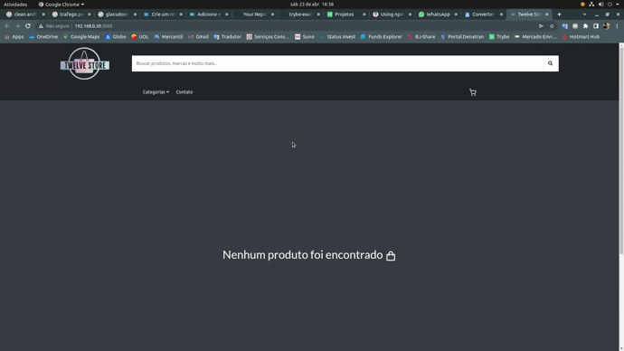

# Projeto Frontend Online Store

## Contexto

Neste projeto, foi desenvolvido versão simplificada, sem persistência no banco de dados, de uma **loja online**, desenvolvendo em grupo suas funcionalidades de acordo com demandas definidas em um quadro _Kanban_, em um cenário mais próximo ao do mercado de trabalho. A partir dessas demandas, teremos uma aplicação onde os usuários poderão:
  - Buscar produtos por termos e categorias a partir da _API do Mercado Livre_;
  - Interagir com os produtos buscados de modo a adicioná-los e removê-los de um carrinho de compras em diferentes quantidades;
  - Visualizar detalhes e avaliações prévias de um produto, bem como criar novas avaliações;
  - E por fim, finalizar a compra (simulada) dos itens selecionados.



## Técnologias usadas

Projeto desenvolvido em React.

## Projeto em grupo, participantes:
* [Lucas Accurcio](https://www.linkedin.com/in/lucas-accurcio/)
* [Michael Caxias](https://www.linkedin.com/in/michaelcaxias/)
* [Cassio Mascarenhas](https://www.linkedin.com/in/c%C3%A1ssio-mascarenhas-40026019b/)
* [Anastácio Neto](https://www.linkedin.com/in/anastacio-neto/)
* [Julio Fallace](https://www.linkedin.com/in/julio-cesar-fallace-filho-144a94b3/)

## Habilidades desenvolvidas

Neste projeto, pude desenvolver as seguintes habilidades:

* Entender o que são Métodos Ágeis
* Entender o que é Kanban
* Entender o que é Scrum
* Trabalhar em equipes utilizando Kanban ou Scrum de maneira eficaz
  - Utilizar **PropTypes** para garantir que uma prop é um array com elementos de um determinado tipo

## Executando aplicação

1. Clone o repositório
  * `git clone git@github.com:LucasAccurcio/frontend-online-store.git`.
  * Entre na pasta do repositório que você acabou de clonar:
    * `cd frontend-online-store`

2. Instale as dependências
  * `npm install`

## Executando a aplicação

* Para rodar a aplicação:

  ```
    npm start
  ```